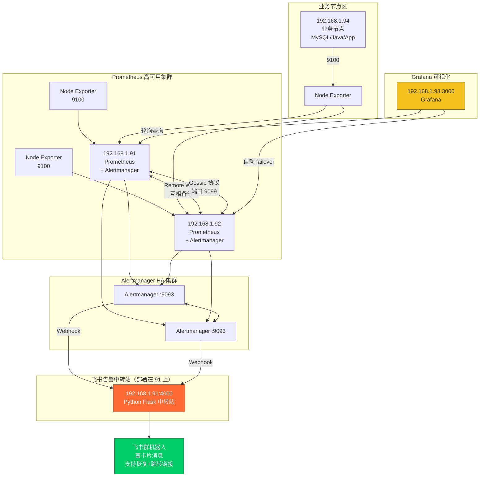

# Prometheus + Alertmanager HA + 飞书高级卡片告警（中转站版）

搭建企业级 Prometheus 监控告警系统，支持：
- Prometheus 双节点 （Remote Write）
- Alertmanager 高可用集群
- 飞书交互式卡片告警（支持恢复、点击跳转、批量合并）
- 完整告警规则（NodeDown / CPU / 内存 / 磁盘）
- Grafana 官方仪表盘 1860

已测试验证，告警必达，永不漏报！

## 架构图



## 效果展示（飞书实收）

| 告警触发（红色）         | 告警恢复（绿色）         |
| ------------------------ | ------------------------ |
| 效果图见 screenshots目录 | 效果图见 screenshots目录 |

* 飞书中转站（建议部署在 prometheus主机上，一台部署即可）

## 环境要求

- 4 台 CentOS 8/9 或 Rocky Linux（最小 2核2G）
- 内网互通，无防火墙/SELinux（实验环境）

| IP           | 主机名  | 角色                      |
| ------------ | ------- | ------------------------- |
| 192.168.1.91 | prom01  | Prometheus + Alertmanager |
| 192.168.1.92 | prom02  | Prometheus + Alertmanager |
| 192.168.1.93 | grafana | Grafana                   |
| 192.168.1.94 | test    | 测试节点                  |

----

## 配置文件（直接复制）

* Prometheus 主配置

* 告警规则（已修复所有坑）

* Alertmanager 配置（带 http_config）

* 飞书中转站 Python 版（实时监听alerting）

  * feishu_alert_proxy.py 脚本中的飞书 webhook地址，大家替换成自己的。

  * ```
    #安装必要的依赖
    dnf install -y python3-pip python3-flask
    pip3 install requests flask
    ```

  * ```
    # 启动测试
    python3 /opt/feishu_alert_proxy.py
    ```

    

## 测试告警


```bash
# 停掉 node_exporter 测试宕机：
systemctl stop node_exporter

```

> → 2 分钟内收到 业务节点已宕机 红色告警
>
> → 当你手动重启node_exporter服务，飞书也能很快识别，并给出回复信息


````bash
# 也可在 94 上压测 CPU, 看看飞书是否能收到告警信息
dnf install -y stress
stress --cpu 16 --timeout 600
````

---

## 免责声明与使用建议

- 本项目主要用于**学习、测试、验证思路**，已完整跑通所有功能，可作为企业级监控告警落地的参考实现。
- 若要在**生产环境**使用，请务必根据自身业务特点做进一步强化，例如但不限于：
  - 配置持久化存储（Prometheus 使用 remote_write + Thanos/Mimir/Cortex）
  - Alertmanager 添加邮件、企业微信、钉钉等多通道通知
  - 增加认证（Basic Auth / OAuth2 Proxy / Nginx）
  - 配置 TLS 加密传输
  - 完善 inhibit_rules、route 路由策略
  - 加入黑名单/白名单、静默规则（silences）
  - 监控 Prometheus、Alertmanager、Grafana 自身
  - 接入备份与灾备方案

  以上内容请参考官方文档自行实现，本项目不再提供。

- 本项目还有很多可以优化的地方（比如 grafana面板的参数配置（达到新旧版本的兼容）、Prometheus 联邦抓取（Federation）、配置自动化等），欢迎大家：
  - Star ✭
  - Fork → 优化 → 提交 PR
  - 提出宝贵建议（Issue）

有问题随时提，我看到都会回复，也欢迎大佬们一起把这个小项目打造成社区里最丝滑的「Prometheus + 飞书告警」参考实现！

> 最后，祝所有看到这里的同学：监控不失联，告警不漏报，升职加薪，当上 CTO，迎娶白富美！